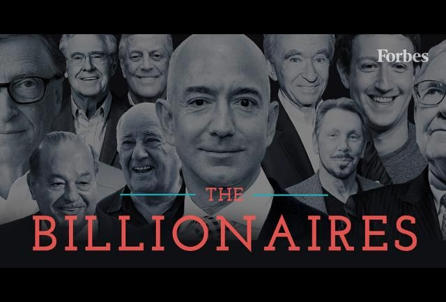

# 2022ForbesBillionaire

So many insights but will share just a few:

The list comprised of 2600 Billionaires from 75 Countries and 18 Industries with an Average NetWorth of over $4 Billion.

Elon tops the list with as the richest Forbes Billionaire' here is the list of Top 5 Billionaires with their NetWorth;

 Elon Musk $219 Billion

 Jeff Bezos $171B

Bernard Arnault & Family $158B

Bill Gates $129B

Warren Buffet $118B

As a NIgerian, I had to use the Country slicer and we have 3 Nigerians topping the list is Aliko Dangote ($14B)

MIke Adenuga ($7.3B)

and Abdulsamad Rabiu ($6.9B).

The Richest Industry is Automotive with an Average NetWorth of over $8 billion of which Elon Musk is in.

The Countries with the highest Billionaires is United States having 719 billionaires second to China with 515.

The most interesting part for me is knowing that being a billionaire in not only for the adults; 19 years old Kevin David Lehmann is the youngest Billionaire from Germany with a NetWorth of $2.4B in the Fashion Industry.

And if you're not yet 100 years old as George Joseph of United States with a NetWorth of $1.8B, you can still be a billionaire😁.

