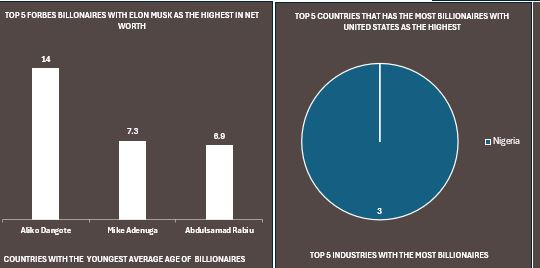

# 2022ForbesBillionaire

## Introduction
This is a Microsoft Excel project on **2022 Forbes Analysis**. The project is to analyze and derive insights to answer crucial questions and help make the data into something consumers can understand.

## Problem Statement
1. Who is the richest man
2. Who are the Top % richest men as at 2022
3. Which is the richest industry
4. Which is the country with most billionaires
5. Who is the youngest billionaire
6. Who is the oldest billionaire
7. The richest men in Nigeria

## Skills demonstrated
- Data Cleaning
- Excel functions
- Pivot Table
- Pivot Charts
- Dashbord

## Insights derived

So many insights but will share just a few:

The list comprised of 2600 Billionaires from 75 Countries and 18 Industries with an Average NetWorth of over $4 Billion.

The Countries with the highest Billionaires is United States having 719 billionaires second to China with 515.
The Richest Industry is Automotive with an Average NetWorth of over $8 billion of which Elon Musk is in.

---
Elon tops the list with as the richest Forbes Billionaire' here is the list of Top 5 Billionaires with their NetWorth;

 1. Elon Musk $219 Billion

2.  Jeff Bezos $171B

3. Bernard Arnault & Family $158B

4. Bill Gates $129B

5. Warren Buffet $118B

---
As a NIgerian 😄, I had to use the Country slicer and we have 3 Nigerians topping the list is 
1. Aliko Dangote ($14B)

2. MIke Adenuga ($7.3B)

3. and Abdulsamad Rabiu ($6.9B).

---
The most interesting part for me is knowing that being a billionaire in not only for the adults; 19 years old Kevin David Lehmann is the youngest Billionaire from Germany with a NetWorth of $2.4B in the Fashion Industry.

And if you're not yet 100 years old as George Joseph of United States with a NetWorth of $1.8B, you can still be a billionaire😁.

## Recommendation
For a deep dive into the analytics, the data, analysis and visualiization done on Excel is added for yor persual.

